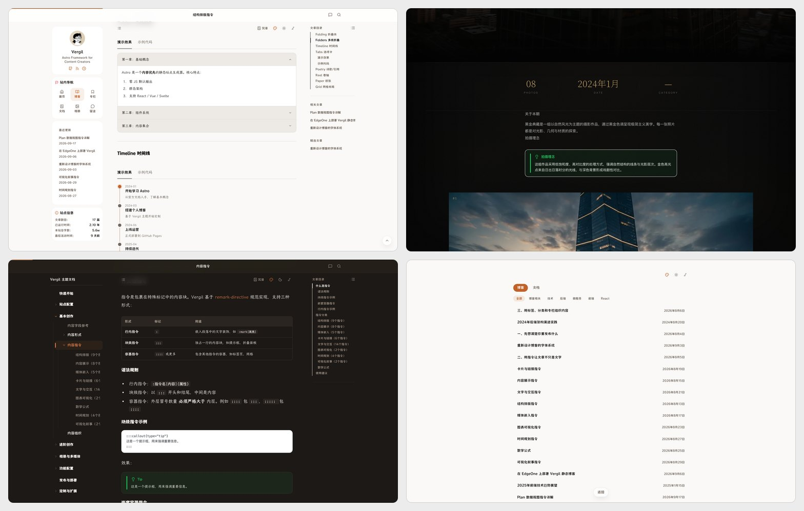

<div align="center">

# Vergil

**写 Markdown，剩下的交给主题。**

一套基于 Astro 的内容站点框架。提示框、时间线、图表、相册、看板这些东西都做成了 Markdown 指令，不用写组件，不用碰 CSS。

[](https://astro.build)
[](https://tailwindcss.com)
[](https://www.typescriptlang.org)
[](LICENSE)
[](https://github.com/wsjz/vergil-astro-theme)


</div>

## 快速开始

需要 Node.js 22（CI 上用的版本）和 pnpm。

```bash
git clone https://github.com/wsjz/vergil-astro-theme.git
cd vergil-astro-theme
pnpm install
pnpm dev
```

仓库自带的文章、相册、示例文档是演示内容。确认能跑起来之后，清掉它们：

```bash
pnpm reset     # 加 --dry 先看会删什么
```

`pnpm reset` 会保留站内的 Vergil 使用文档，那是你之后要查的东西。想一起删掉加 `--all`。

## 它能做什么

写一段 `:::` 指令，得到一个组件：

```markdown
:::callout{type="tip"}
这是一条小技巧，读者一眼就能注意到。
:::

:::timeline
- 2024-01 | 项目启动
- 2024-06 | 第一个版本
:::

:::video{bilibili="BV1xx411c7mD"}
:::
```

一共 50 个指令，按用途分为八类：结构排版、内容展示、媒体嵌入、卡片与链接、文字与交互、图表可视化、时间规划、可视化叙事。数学公式用 `$...$` 直接写，不需要指令。

除了指令，Vergil 还提供这些：

| | |
|---|---|
| **多视图** | 默认视图、沉浸阅读、简历模式，各自独立的布局和导航 |
| **内容组织** | 标签、分类、专栏、层级文档，四个维度自由组合 |
| **相册** | Golden 与 Seasons 两套主题，Lightbox、EXIF 信息、季节过滤 |
| **侧边栏** | 左右侧栏组件可插拔，热力图、标签云、目录、相关文章 |
| **开箱即用** | 深色模式、全文搜索、评论、RSS、Sitemap、站点助理 |
| **界面语言** | 主题文案支持中英切换，你写的内容不受影响 |



四格分别是：文章里的折叠块与时间线指令、Golden 主题的影集、带侧边目录树的知识库、按分类筛选的沉浸阅读视图。

具体怎么配、怎么写，跑起来之后站内的 `/docs` 就是完整文档，源文件在 [`src/content/docs/vergil-guide/`](src/content/docs/vergil-guide)。

## 生态工具

- **[vergil-cli](https://github.com/vergil-astro/vergil-cli)** — 命令行工具 `vg`，初始化项目、新建文章相册动态、发布草稿
- **[vergil-writing-skills](https://github.com/vergil-astro/vergil-writing-skills)** — AI 写作技能，让助手用 Vergil 指令帮你排版，支持 Claude Code、Codex CLI、Cursor、Gemini CLI

## 参与贡献

Vergil 由个人在业余时间维护，欢迎提 Bug、聊想法、改文档、翻译界面文字。

改代码之前建议先开一个 [issue](https://github.com/wsjz/vergil-astro-theme/issues) 聊聊思路，免得白写。提交信息遵循 [Conventional Commits](https://www.conventionalcommits.org/)。

接下来要做什么、已经在做什么，都在 [issues](https://github.com/wsjz/vergil-astro-theme/issues) 里。

## 关于名字

Vergil 基于极简主题 [Dante](https://github.com/JustGoodUI/dante-astro-theme) 做了大量改造。名字致敬但丁的老对手，也代表这个项目从极简出发、走向体系化的方向。

## 致谢

- [Dante](https://github.com/JustGoodUI/dante-astro-theme) — Vergil 的起点
- [Hexo Stellar](https://github.com/xaoxuu/hexo-theme-stellar) — 标签体系与文档系统的设计灵感
- [Astro](https://astro.build) — 让静态站点开发重新变得有趣

## License

[MIT](LICENSE)
