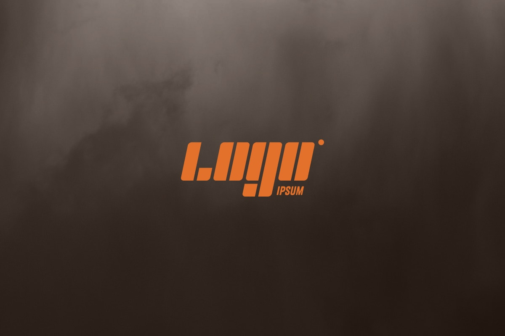

:::callout{type="note" title="示例项目"}
这是一个虚构的项目，用来演示项目列表里不同类型的条目。
:::

## 为什么开始

想找一个不用面对镜头的表达方式。写字太慢，视频太重，声音刚好。

## 设备

一开始想一步到位，买了声卡和电容麦，结果房间没做声学处理，录出来全是回声。后来换成动圈麦加桌面支架，反而干净了。

:::callout{type="warning" title="踩过的坑"}
先解决房间，再解决麦克风。在一个会反射的房间里，贵的设备只会把噪音录得更清楚。
:::

## 流程

:::timeline
- 周一 | 定选题 | 列三个候选，选当下最想聊的那个
- 周三 | 录制 | 不写逐字稿，只列提纲，一次录完不重来
- 周五 | 剪辑 | 只剪明显的口误和长停顿，保留呼吸
- 周日 | 发布 | 写节目简介，上传，同步到各平台
:::

## 两年之后

四十期，平均每期三十五分钟。听众不多，但留言的质量很高。

做下去的理由和刚开始不一样了。一开始是想被听到，现在是因为每期录完，自己对那个话题的想法确实更清楚了一点。
